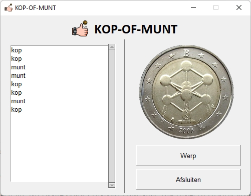
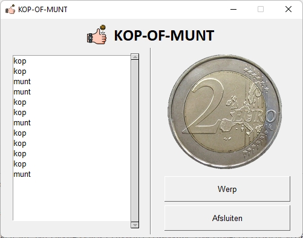

# Oefening 04

In dit project maak je een kleiner applicatie met grafische gebruikersinterface waarbij je met een druk op een knop een muntstuk opwerpt. 

## Doel

Je maakt een kleine applicatie waarmee je een muntstuk opwerpt.  

Iedere keer wanneer de gebruiker op de knop 'Werp' klikt werp je het muntstuk op.  Je toont - van het muntstuk - de corresponderende afbeelding en in een ListBox lijst je alle worpen ('kop' of 'munt') op.

 &nbsp; 

## Structuur van het project

De structuur van het project staat hieronder afgebeeld.

```bash
│   main.py
│
├───_klassendiagram
│       klassendiagram.md
├───app
│       app.py
│       app_layout.py
│
├───assets
│       favicon.ico
│       kop.png
│       logo.png
│       munt.png
│
├───bin
│       imagetkhelper.py
│
└───entiteit
        kopofmunt.py
```

We onderscheiden:

* main.py  
  root van het project, heeft als enige doel de eigenlijke applicatie te starten

* \_klassendiagram  
  deze map bevat de markdown-bestanden met de nodige diagrammen
  
  * klassendiagram.md  
    bevat het UML-klassendiagram in 'mermaid' van de entiteitsklasse

* app  
  de Python-scripts in deze map staan in voor de grafische gebruikersinterface van de applicatie
  
  * app.py  
    bevat de klasse 'App' die instaat voor het hoofdvenster vand e applicatie
  
  * app_layout.py  
    bevat de elementen waaruit de grafische interface wordt opgebouwd

* assets  
  bevat afbeeldingen, logo en icon die in de applicatie gebruikt worden

* bin  
  aan deze map kennen we de scripts toe ter ondersteuning van de applicatie.
  
  * imagetkhelper.py  
    dit is een helper bestand en bevat de klasse 'ImageTKHelper' met de statische methoden ``schaal()` en `passend()`.  Deze klasse helpt ons om de afbeeldingen op maat te schalen of bij te snijden en het resultaat kan dynamische aan een element in onze interface worden toegekend.   

* entiteit  
  deze map bevat de entiteitklassen nodig voor de werking van de applicatie
  
  * kopofmunt.py  
    bevat de entiteitklasse 'KopOfMunt' en staat in voor het opwerpen van de munt en het bijhouden van de geschiedenis (de lijst met 'kop' of 'munt')

## Gebruikersinterface

De grafische gebruikerinterface staat hieronder afgebeeld.


De eigenlijke inhoud van de applicatie - onder logo en titel - bestaat uit twee kolommen  : 'kolomLInks' en 'kolomRechts' van elkaar gescheiden door een 'VerticalSeparator' (een element van FreeSimpleGUI).

De linker kolom bestaat uit een 'ListBox' (key: `-LBX-MUNT-`)waarin de geschiedenis van de worpen wordt weergegeven.  

In de rechter kolom staat de afbeelding (key: `-IMG-KOPOFMUNT-`) van de met de huidige worp (kop of munt).  Voor de afbeelding maken we gebruik van een Image-element met grootte 200x200.  Onder de staat de knop 'Werp' (key: `-BTN-WERP-`).  Klikt de gebruiker op deze knop, dan wordt de munt opnieuw opgeworpen.  De afbeelding wordt geüpdate aan de nieuwe waarde (kop of munt) en de ListBox met de geschiedenis wordt aangevuld.  Ten slotte de knop 'Afsluiten' (key: `-BTN-AFSLUITEN-`) waarmee de gebruiker de applicatie kan beëindigen.

Verder zorgen we ervoor dat:

* de applicatie niet verschaald kan worden

* de applicatie alleen met de knop 'Afsluiten' kan beëindigd worden
